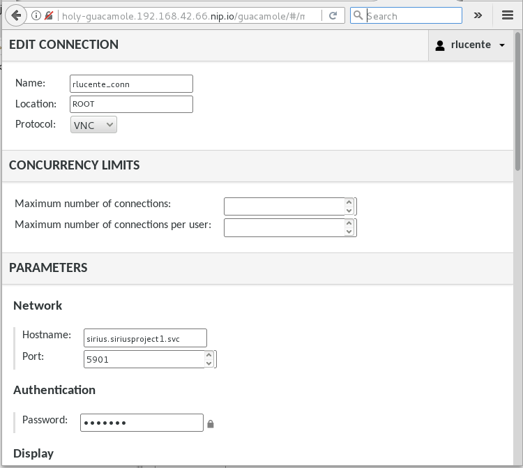

This repository is forked from, and largely based upon, the work from
Richard Lucente's github repository at rlucente-se-jboss/jbds-via-html5.
Much of this Readme is borrowed from the Readme  of that repository also.
That work describes how to get  jboss developer studio running in a container
and accessable via the web using apache guacamole. The goal of this repository 
is to run eclipse sirius instead. So minor differences are that Eclipse Sirius is
started instead of jboss developer studio (they are both eclipse based projects
which run in a JVM). Also I try to ensure that this can
be run on openshift online as well as a local openshift 'minishift' platform
(openshift online does not allow the do a strategy=docker deploy, 
which is only a minor hurdle , also openshift online has a 10 project limit).
We use the Obeo Designer install as it neatly packages sirius componenents with 
miminal set of plugins.

## Introduction
[Apache Guacamole](https://guacamole.incubator.apache.org/) is an
incubating Apache project that enables X window applications to be
exposed via HTML5 and accessed via a browser.  This article shows
how guacamole can be run inside containers in an OpenShift Container
Platform (OCP) cluster to enable eclipse sirius , an
eclipse-based IDE for modelling applications, to be accessed
via a web browser.  

## How does Apache Guacamole work?
Apache Guacamole consists of two main components, the guacamole web
application (known as the guacamole-client) and the guacamole daemon
(or guacd).  An X windows application runs in an Xvnc environment
with an in-memory only display.  The guacd daemon acts as an Xvnc
client, consuming the Xvnc events and sending them to the Tomcat
guacamole-client web application where they are then rendered to
the client browser as HTML5.  Guacamole also supports user
authentication, multiple sessions, and other features that this
article only touches on.  The [Apache Guacamole](https://guacamole.incubator.apache.org) web site has
more information.

## Login to OpenShift Container Platform
This was tested on a cloud-based OpenShift installation as well as
a laptop using the [Red Hat Container Development
Kit](https://developers.redhat.com/products/cdk/overview/).  This
article uses CDK 3, so please adjust accordingly if using an
alternative OpenShift Container Platform installation.  CDK3 leverages
the `minishift` command to stand up a virtual machine for OCP.

From a command line terminal, configure and start minishift:

    minishift setup-cdk --default-vm-driver virtualbox 
    minishift start --cpus 4 --disk-size 50g --memory 10240 --username 'RHN_USERNAME' --password 'RHN_PASSWORD'

It is possible that the first step will not be required if you have 
already setup the minishift environment, and possible that you will
be using a different default-vm-driver such as KVM.

Substitute the `RHN_USERNAME` and `RHN_PASSWORD` credentials above
with your login credentials from either the
[Red Hat Developer's Portal](https://developers.redhat.com) or
the [Red Hat Customer Service Portal](https://access.redhat.com).
You also may need to change the command line flags or set additional
command line flags for your environment.  You can see all the options
for the `minishift` commands by adding the `--help` option.

Make sure to add the `oc` command to your executable search path.
On my laptop, the path is `$HOME/.minishift/cache/oc/v3.5.5.8/oc`.
Use whatever path is appropriate for your minishift installation.

Once minishift has finished starting up, determine the IP address
for the minishift instance then login:

    IP_ADDR=$(minishift ip)
    oc login https://$IP_ADDR:8443 -u developer

For minishift, the password is 'developer'.

## Enabling Unprivileged Guacamole Client Containers
The guacamole project supplies Docker Hub images to simplify deploying
guacamole in a container.  However, the guacamole-client runs as a
privileged container by default.  A thin wrapper around the guacamole
image was created so it could run unprivileged within OpenShift.
Please refer to the
[guacamole-client-wrapper](https://github.com/rlucente-se-jboss/guacamole-client-wrapper)
project on github for more information on how this was done.  That
project was used to extend the `guacamole/guacamole` image on Docker
Hub to create the `rlucentesejboss/guacamole` image that is used
for the guacamole-client.

## Install the Guacamole Components
First, create a project for guacamole within the OpenShift Container
Platform.

    oc new-project guacamole

A persistent MySQL instance stores guacamole data including users
and their credentials.  Create the guacamole MySQL instance and
then modify it to use a persistent volume.  The MySQL database
persists users and connection parameters within guacamole.

    oc new-app mysql MYSQL_USER=guacamole MYSQL_PASSWORD=guacamole \
        MYSQL_DATABASE=guacamole
    oc volume dc/mysql --add --name=mysql-volume-1 -t pvc \
        --claim-name=mysql-data --claim-size=1G --overwrite

The guacamole image includes helper scripts for database initialization.
Run the guacamole image to create a database initialization script
for the MySQL database.  Use the `oc run` command to run the image
with an alternative start command.

    oc run guacamole --image=rlucentesejboss/guacamole --restart=Never \
        --command -- /opt/guacamole/bin/initdb.sh --mysql 

The `initdb.sh` command runs within a pod named `guacamole`.  When
the command completes, the MySQL initialization script will be in
the container log.  Put the initialization script into a SQL file
and remove the pod.

    oc logs guacamole > initdb.sql
    oc delete pod guacamole

At this point, the MySQL pod should be fully running, but it may
have restarted due to the deployment configuration change to add
the persistent volume claim.  Get the list of running pods to
determine the pod-id for MySQL.

    oc get pods

Identify the path to the MySQL client application within the pod.
To do that, type the following:

    oc rsh mysql-<pod-id>
    echo $PATH | cut -d: -f1
    exit

Use the pod-id and the executable path from the above command to
initialize the guacamole database:

    oc rsh mysql-<pod id> <exec-path>/mysql -h 127.0.0.1 -P 3306 \
        -u guacamole -pguacamole guacamole < initdb.sql

The above line initializes the MySQL database with all of the tables
and artifacts required to support guacamole.  Once the database is
initialized, create an application where both guacamole and guacd
are in a single pod.  The additional parameters will connect guacamole
to its database.

    oc new-app rlucentesejboss/guacamole+guacamole/guacd \
        --name=holy \
        GUACAMOLE_HOME=/home/guacamole/.guacamole \
        GUACD_HOSTNAME=127.0.0.1 \
        GUACD_PORT=4822 \
        MYSQL_HOSTNAME=mysql.guacamole.svc.cluster.local \
        MYSQL_PORT=3306 \
        MYSQL_DATABASE=guacamole \
        MYSQL_USER=guacamole \
        MYSQL_PASSWORD=guacamole

The last thing to do is expose a route for the guacamole application.

    oc expose service holy --port=8080 --path=/guacamole

## Configure Guacamole Users
Browse the the guacamole application.  On the CDK, the URL is
[holy-guacamole.192.168.42.66.nip.io/guacamole](holy-guacamole.192.168.42.66.nip.io/guacamole).
Make sure that the URL is appropriate for your environment. You can
find the exact URL for your environment by going to the openshift web
console, opening the guacamole project, and clicking overview. You will
see the URL in the top right corner :

The
login page for guacamole will appear.  Use the default username and
password of `guacadmin/guacadmin` as shown.

Once logged in, go to the upper right hand corner and select
"guacadmin -> Settings" in the drop down menu, as shown.

Select the "Users" tab and then click the "New User" button.

Set the username and password to whatever you desire.  As an
administrator, you can create multiple user accounts that can use
guacamole to connect to their own instances of Sirius.
Also, grant the permissions "Create new connections" and
"Change own password".  Click "Save" to add the user.

Log out of the guacamole web application.

The user is now configured to create a connection to their instance
of Sirius and access it via a browser.  

## Sirius Container build
We have already built  the Sirius container image and stored it in dockerhub.
It downlopaded and used the Obeo Designer 10 install.
Also in that container we have added bundles to allow the user to easily use
the  example family model. Note that to do this we created an eclipse update site,
which is stored as the directory. 
https://github.com/neilmackenzie/jbds-via-html5/tree/master/resources/family_updatesite

To create that update site we followed the instructions here:
https://www.eclipse.org/forums/index.php/t/1076701/

You can see how this conatiner is built by looking at the docker file in this repository.
We reference this from dockerhub which builds and stores the container:
https://hub.docker.com/r/neilmackenzie/jbds-via-html5/

## Instantiate the Sirius Container
Each user simply provisions a Sirius container instance and then
grants guacamole permission to view it. If using openshift online 
we suggest just adding this app to the same project, since only 10 projects
are allowed in openshift online. in this example we create a seperate project.
You will not need to grant access if you are deploying in the same project.

Execute the commands below:

    oc new-project someproject
    oc policy add-role-to-user view system:serviceaccount:guacamole:default
    oc new-app neilmackenzie/jbds-via-html5 --name=sirius 
   
    
If the apps are deployed in the same project we suggest using 
'oc new-app neilmackenzie/jbds-via-html5 --name= sirius-X' 
where sirius-X is sirius-1 or sirius-2 etc (we will deploy one sirius app per user).

## Access the Sirius  Container via a Browser
A developer can now access the sirius application
via a browser.  On the CDK, the URL is
[holy-guacamole.192.168.42.66.nip.io/guacamole](holy-guacamole.192.168.42.66.nip.io/guacamole).
Make sure that the URL is appropriate for your environment.  When
presented with the login screen, use the username/password that was
created by the guacamole administrator.  Once logged in, in the upper right hand corner
select "username -> Settings", as shown.

Select the "Connections" tab and then click the "New Connection"
button.

Set the following parameters:

| Parameter | Value |
| --------- | ----- |
| Name | sirius |
| Hostname | sirius.someproject.svc.cluster.local |
| Port | 5901 |
| Password | VNCPASS |

Hostname is the name of the service, 
it will depend upon the projects and app name that you chose (like sirius or sirius-X)
It can be viewed by looking at the service in the openshift console by
clicking application->serives:

and clicking on the service to see:

after setting the parameters, Click "Save" to add the connection. 
The connection should look something like this:

In the upper right hand corner, select "username -> rlucente_conn" to open
the connection.

Obeo Developer Studio will appear within the browser window.

## Try it out

close the 'welcome'tab.

click file->new-> example- and choose 'Basic Family Sample Model' 
, then click next , and then finish.

expand the tree and right click on Family, and choose new reresentation -> other, 
then choose 'Persons diagram', click finish then OK.

then play with modeling on the web:

Note that in this setup there is no persistant storage if a container is restarted,
so any work would be lost. This could be resolved by addin persistant storage,
or alternatively users using  the inbuilt git integration git to store their
changes in git.

## Play with Guacamole

pressing CTRL-ALT-SPACE you can get back to the properties screen for the user
for gaucamole.

## Memory contraints, particularly for openshift online

Following these instructions on your own local CDK 3 install you should not need 
to set any memory constraints.
Openshift online by default gives 512Mb to each pod, which is not enough. 
we have tested this succesfully  with 2 running sirius apps  with the following memory assigned 
to each container:

Container: HOLY, Image: rlucentesejboss/guacamole , max 1000 Mb
Container: HOLY-1 , Image: guacamole/guacd max , 257 Mb
Container : MYSQL , Image: rhscl/mysql-57-rhel7 , max 512Mb
Container : SIRIUS, Image: neilmackenzie/jbds-via-html5 , max 1350 Mb

We do not expect that the gaucamole containers or mysql containers will need 
significantly more memory (or CPU) to run more sirius applications, 
but we have not tested this.

To alter memory constraints in openshift online you can use the web console
and go to the deployment, choose actions->edit resource limits.

## Proposed further work

This solution currently requires users to have access to openshift if
they would like to create/start or stop their own container.
It would be nice if users could do this without having access to openshift.
One propsal would to do this would be the following:

1.) Let the gaucamole Guacadmin user set all connections.
2.) Dont allow users to set their own connections (so they will have access only
to the Guacamole preferences screen)
3.) Add an item to the Guacamole javascript web application to stop start the 
container. The most likely location would be :
guacamole-client/guacamole/src/main/webapp/app/settings/services/preferenceService.js
from the open source guacamole project:
https://github.com/glyptodon/guacamole-client
4.) Stoping and starting would be equivalanet to scaling the POD to 0 or 1 replicas.
this could be done via the kubernetes REST API.
5.) Access and authentication from the guacamole POD to the Kebernetes REST API may 
be simplified by having the kubectl proxy running in a side container to the pod as
described in:
https://github.com/kubernetes/examples/blob/master/staging/kubectl-container/README.md

managing a timeout so that pods shutdown when not being used for a few hours could
be useful feature in order to constrain used resources.

